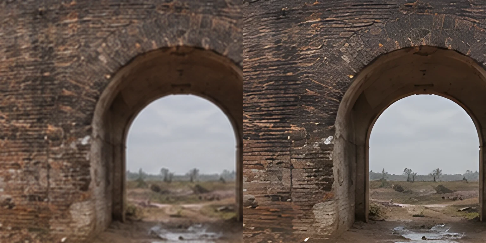

# Nâng nét sáu panorama

Ảnh nguồn rộng 1774 pixel cho toàn bộ 360°. Ở góc nhìn ngang 100°, chỉ khoảng 493 pixel nguồn phủ chiều ngang màn hình. Đây là nguyên nhân chính khiến ảnh bị mềm khi xem toàn màn hình; CSS không áp dụng bộ lọc làm mờ lên cảnh.

## Quy trình

- Dùng sáu PNG gốc của bộ ảnh thứ hai, được ghi trong [manifest tạo ảnh](asset-prompts-v2.json). Không dùng bản WebP đã nén để suy luận.
- Chạy [Real-ESRGAN ncnn Vulkan](https://github.com/xinntao/Real-ESRGAN-ncnn-vulkan) v0.2.0 với mô hình `realesrgan-x4plus` dành cho ảnh thông thường, hệ số 4, một luồng xử lý GPU. Mô hình từ [gói phát hành chính thức](https://github.com/xinntao/Real-ESRGAN/releases/tag/v0.2.5.0).
- Ghép thêm 64 pixel từ cạnh đối diện ở mỗi bên trước khi xử lý, rồi cắt phần đệm sau suy luận. Điều này cho mô hình ngữ cảnh qua đường nối 360°; không làm cho hình học gốc trở nên chính xác hơn.
- Đầu ra 7096 × 3548, giữ tỷ lệ 2:1; xuất WebP chất lượng 88. Không áp thêm làm sắc cạnh, màu sepia hoặc lớp hạt giả.
- Pannellum tải ảnh ở chế độ tĩnh. Khi ảnh rộng hơn giới hạn texture, thư viện giữ hai nửa ảnh thay vì tải lại toàn bộ ảnh vào một texture ở mỗi khung hình.

Lệnh có thể chạy lại với công cụ và mô hình đã tải sẵn:

Script cần ImageMagick 7, Bash và GPU hỗ trợ Vulkan. Công cụ, mô hình và script không được chạy trong quy trình đăng trang; GitHub Pages chỉ phục vụ các ảnh đã xuất.

```sh
bash scripts/upscale-panorama.sh original.png public/scenes/example.webp \
  /path/to/realesrgan-ncnn-vulkan /path/to/models 128
```

Tên tệp nguồn, mã SHA-256, cấu hình và kích thước đầu ra được ghi trong [manifest xử lý](asset-upscaling.json). Bộ công cụ và mô hình chỉ phục vụ tạo tài nguyên trên máy; website không tải hoặc chạy mô hình AI.

## Giới hạn và vai trò công cụ

Đây là ảnh nâng độ phân giải từ nguồn 1774 × 887, không phải ảnh gốc 7K. Số pixel tăng 16 lần không đồng nghĩa với 16 lần chi tiết lịch sử đã xác minh. Mô hình suy đoán vân bề mặt nhỏ, có thể làm mềm hoặc làm đều một số chất liệu. Nâng nét không sửa mọi biến dạng hình học, vật thể xa hoặc vùng cực trong ảnh gốc. Phần nguồn của trang công bố giới hạn này.

Gemini qua `agy` hỗ trợ rà các phát biểu về độ phân giải và tài liệu kỹ thuật. Không dùng Gemini web tạo hoặc sửa ảnh: chủ dự án đã yêu cầu ngừng computer use. Ảnh cuối được xử lý bằng Real-ESRGAN từ sáu PNG gốc; không tuyên bố chúng do Google tạo lại.

## Kiểm tra

So sánh cùng phần vòm Cổng Hậu: bên trái là ảnh nguồn phóng cùng kích thước; bên phải là bản nâng nét. Mục tiêu là giảm mờ khi xem, không chứng minh thêm chi tiết lịch sử.



Kết quả kiểm tra bản production ngày 22/09/2026:

- Cả 6 tệp đều có kích thước 7096 × 3548; SHA-256 đầu ra khớp bản xuất từ mô hình. Tổng dung lượng 15.640.526 byte, mỗi cảnh khoảng 1,96–2,99 MiB. Trang chỉ tải panorama đang chọn.
- Đã xem góc mở đầu và ba hướng xoay cách nhau 90° của từng cảnh, đồng thời đối chiếu ảnh chụp trước–sau. Mép gạch, vữa và bờ đất rõ hơn; bố cục và tông màu được giữ. Một số vùng xa vẫn mềm và đường nối gốc còn thấy ở một số hướng, nhất là phía sau Nội thành và Phố cũ.
- `npm test`: build TypeScript/Vite thành công, **28/28 kiểm thử đạt** trên Chromium ở cấu hình máy tính và Pixel 7 mô phỏng. Bao gồm cả sáu ảnh lớn, độ phân giải canvas theo mật độ màn hình, chuyển cảnh nhanh, kéo/chạm/phím, phóng to, lịch sử trình duyệt, hộp nguồn, bản đồ, trình chiếu và khôi phục khi tải lỗi.
- Lượt tải đầu dưới 5 MiB trong cả hai cấu hình kiểm thử. Không có tràn ngang trên điện thoại.
- Với ảnh Cổng Hậu thật 7096 × 3548 và giới hạn texture mô phỏng 4096, trình xem tải hai phần 3548 × 3548, không báo lỗi. Kiểm thử hồi quy dùng ảnh tổng hợp nhỏ hơn và giới hạn 1024 để kiểm tra cùng nhánh chia ảnh sau xoay/phóng to. Đây không phải thử trên mọi GPU vật lý; thiết bị không đáp ứng giới hạn vẫn có thông báo lỗi và truy cập nguồn.
- `bash -n scripts/upscale-panorama.sh` và `git diff --check` đạt. Không thêm thư viện chạy trong trình duyệt.

## Rà soát antislop cho thay đổi này

| Cổng kiểm tra | Kết quả | Căn cứ |
| --- | --- | --- |
| Hard-Fail | Đạt | Vào thẳng cảnh, điều khiển hoạt động trong bộ kiểm thử; giữ phân biệt ảnh AI và tư liệu thật. |
| Purpose | Đạt | Tăng độ nét cho cảnh đang xem; không thêm trang trí, hiệu ứng màu hay lời quảng bá. |
| Liveliness | Đạt | Giữ hướng đã chốt trong `DESIGN.md`: ENERGY 1 / RHYTHM 2 / MOTION 1, cảnh là trọng tâm, dấu đất nung chỉ điểm chọn và bảng nguồn mang sắc thái trang sách. |
| Craftsmanship | Đạt trong phạm vi kiểm tra | Đối chiếu hình trước–sau, xem 24 hướng, kiểm thử máy tính/điện thoại và các trạng thái lỗi; công bố giới hạn chi tiết suy đoán và đường nối. |
